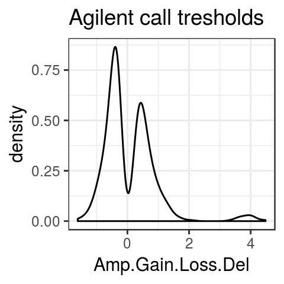
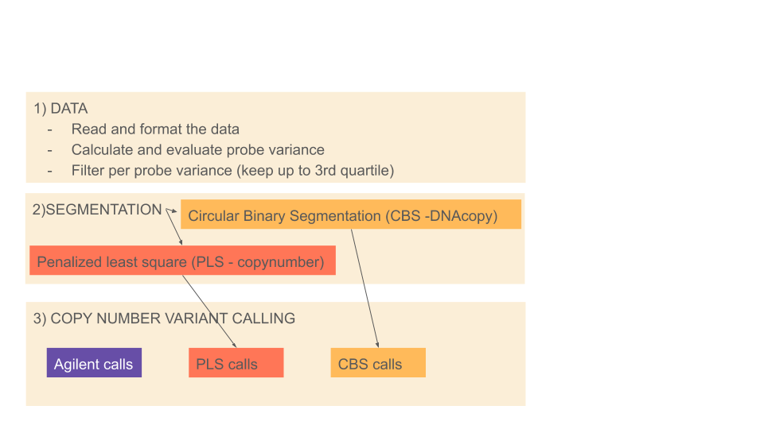
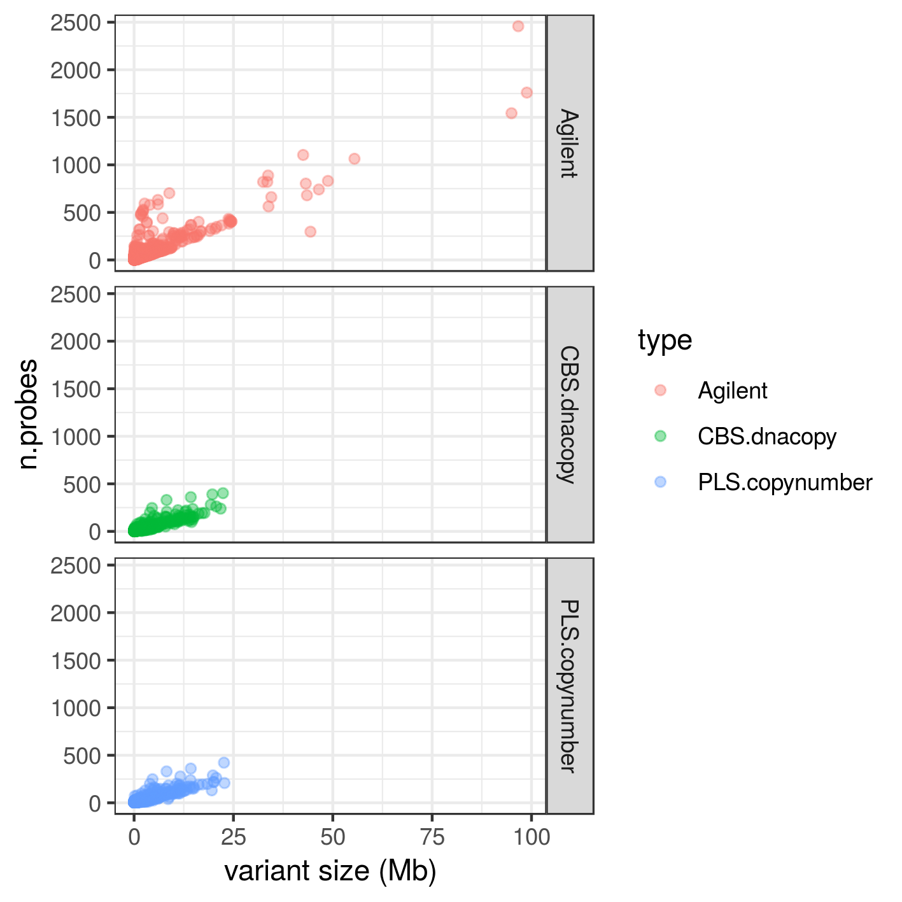
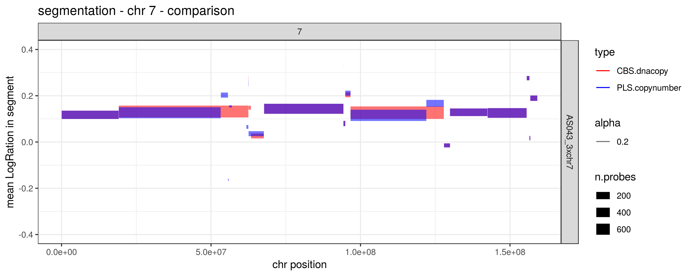
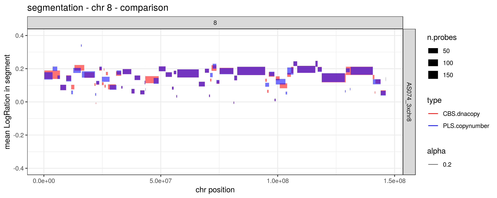
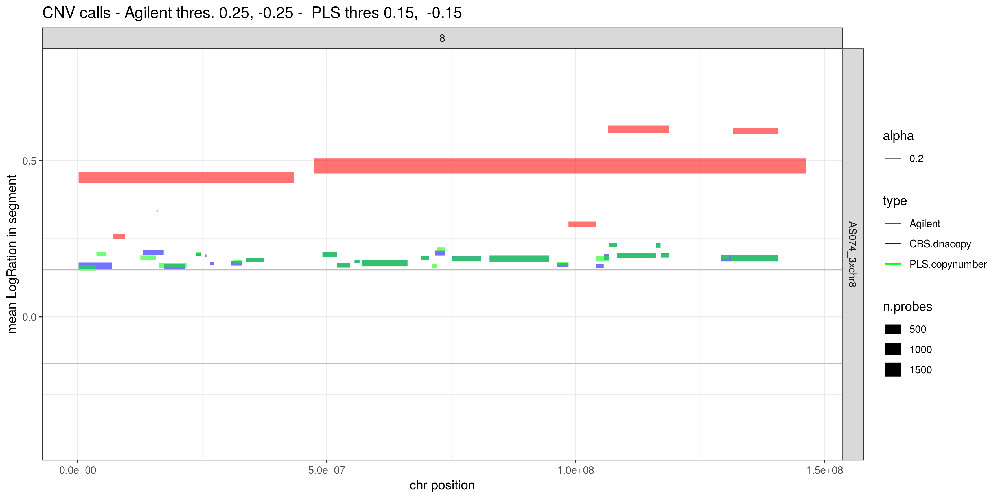

### Copy number detection using array comparative genomic hybridization. A case study 


#### Biological context and Array comparative genomic hybridization

This experiment is part of pre-sequencing screening of aneuploidies in product of conception of recurrent miscarriages. Samples with aneuploidies are discarded from sequencing, while euploid samples have been whole-genome sequenced at high coverage to identify genetic variants responsible for the miscarriage. 


18 samples of DNA extracted from product of conception of recurrent miscarriages screened for genomic rearrangement using Array comparative genomic hybridization ([array CGH, aCGH](https://en.wikipedia.org/wiki/Comparative_genomic_hybridization)) with the Agilent Sure print g3 isca v2 cgh 8x60k platform: 

>The SurePrint G3 ISCA v2 CGH 8x60K dual-color chromosomal microarray contains 60-mer high-quality probes. The ISCA CGH microarray is an effective tool for targeted genome-wide DNA copy number variation profiling without amplification or complexity reduction. |The Agilent SurePrint G3 ISCA v2 CGH 8x60K Microarray is designed with 60 KB overall median probe spacing and enhanced coverage on ISCA regions. The microarray includes 18,851 distinct biological features in ISCA regions and 40,208 backbone probes. In addition, the microarray contains a range of internal quality control features. 


For space reason only three samples uploaded on git 

[Here, from  slide 19 onwards]() more details on this project and the use of ArrayCHG in this context.  

#### Libraries R-equired: 

```
library(ggplot2)
library(DNAcopy)
library(tidyr)
library(dplyr) 
library(copynumber) 
```

- [copynumber](https://bioconductor.org/packages/release/bioc/html/copynumber.html)  on Bioconductor 
- Links to the [copynumber tutorial](https://bioconductor.org/packages/release/bioc/vignettes/copynumber/inst/doc/copynumber.pdf)
and the [copynumber documentation](https://bioconductor.org/packages/release/bioc/manuals/copynumber/man/copynumber.pdf) 
- [DNAcopy](https://bioconductor.org/packages/release/bioc/html/DNAcopy.html)
 


#### Procedure 

- - - -
<details>
<summary>STEP 1: Data preprocessing  </summary>
<p> 
 
##### Formatting data 

The imput file is in the  folder data and looks like 
```
hr     start   as_sample       LogRatio
9       13638428        AS006_good      -3.730386303e-002
23      18634351        AS006_good      -2.629302068e-002
6       121426906       AS006_good      -2.522241234e-002
2       162718809       AS006_good      -1.018516467e-001
11      115072736       AS006_good      -7.987021913e-003
2       196233275       AS006_good      -1.999652319e-003
23      18525214        AS006_good      -8.723768348e-002
12      60800909        AS006_good      -1.349150180e-001
```

Data form different samples have been concatenated while `copynumber` requires data arranged as: 
> tab separated Column 1 numeric or character chr numbers, column 2 numeric local probe positions, subsequent column(s) the numeric copy number measurements for one or more samples (LogRatio) header of copy number columns should give sample IDs


Therefore we need to rearrange the data (I will use `distinct` from *dplyr* and `spread` from *tydir*  ): 
```
#### read the data 
imma=read.table(gzfile("all.arraychr.head.tsv.forCopynumber.red.gz"), header=T, sep ="\t" )

#### remove duplicates  (artifact from this particular experiment)
imma.noduplicat <- imma %>% distinct(chr, start, as_sample , .keep_all = TRUE) 

#### spread
imma.spread<- imma.noduplicat  %>%  spread(as_sample , LogRatio )
```

At this point the data looks like: 
```
> head (imma.spread)
  chr  start  AS006_good   AS015_bad AS074_3xchr8
1   1 120858 -0.08402374 -0.06140896 -0.019594946
2   1 252304  0.06791855  0.15655191  0.047254993
3   1 421256  0.19047230  0.08022728 -0.044166946
4   1 779727  0.14821407  0.16200489  0.151237221
5   1 834101  0.01549497 -0.05585227 -0.052730029
6   1 839450  0.19701140  0.04511940  0.003677939

```


##### Filter per variance in probes 

It is useful to remove probes with extreme variance: 
```
#### check perprobe variance 
imma.spread$prob.var <- apply (imma.spread[,3:5], 1 , var)
```

This adds a column with probe variance: 
```
> head (imma.spread)
  chr  start  AS006_good   AS015_bad AS074_3xchr8     prob.var
1   1 120858 -0.08402374 -0.06140896 -0.019594946 1.068485e-03
2   1 252304  0.06791855  0.15655191  0.047254993 3.371445e-03
3   1 421256  0.19047230  0.08022728 -0.044166946 1.378058e-02
4   1 779727  0.14821407  0.16200489  0.151237221 5.254479e-05
5   1 834101  0.01549497 -0.05585227 -0.052730029 1.625804e-03
6   1 839450  0.19701140  0.04511940  0.003677939 1.036107e-02
```
 
Ggplot the variance per probe: 
```
ggplot(imma.spread, aes(as.factor(chr), prob.var))+ geom_boxplot ()+theme_bw()+ggtitle("Per-probe variance per-cromosome")
```

Remove the probes with extreme variance by removing the correspondant rows: 
```
## find the covariance threshold 
covariancetreshold= unname(quantile(imma.spread$prob.var, 0.99 ) )

covariancetreshold
[1] 0.03405442

## making final dataset filtered by covariance 
imma.copynumber <- subset(imma.spread, prob.var<covariancetreshold) 

## chek if filtering was effective: 
max (imma.spread$prob.var)
[1] 0.4209459
max (imma.copynumber$prob.var)
[1] 0.03405438

length (imma.spread$prob.var)
[1] 59008
length (imma.copynumber$prob.var)
[1] 58417

## finalizing: 
imma.copynumber$prob.var <- NULL  ## remove the column prob.var 

```

In fact the `winsorize` function form *copynumber* removes extreme values!!!  
```
imma.wins <- winsorize(data=imma.spread,verbose=FALSE) 

## check 
max(imma.spread$prob.var)
[1] 0.4209459
max(imma.wins$prob.var)
[1] 0.0907
max(imma.copynumber$prob.var)
[1] 0.03405438

```
With basic values `winsorize` is less stringent than my "variance" criteria, but can be finely tuened. 

</p>
</details>

- - - -

<details>
<summary>STEP 2:  Segmentation </summary>
<p>
 
##### Choose model parameters

From the [`copynumber` paper](https://bmcgenomics.biomedcentral.com/articles/10.1186/1471-2164-13-591): 

> In particular, the proposed method utilizes penalized least squares regression to determine a piecewise constant fit to the data. Introducing a fixed penalty γ>0 for any difference in the fitted values of two neighboring observations induces an optimal solution of particular relevance to copy number data: a piecewise constant curve fully determined by the breakpoints and the average copy number values on each segment. The user defined penalty γ essentially controls the level of empirical evidence required to introduce a breakpoint. Given the number of breakpoints, the solution will be optimal in terms of least squares error.

We will use the `plotGamma` function from *copynumber* to find out what is the best parameter for segmentation. We will test segmentation on chromosome 1 of the first sample in the `imma.copynumber` data frame:  

```
imma.chr=1
imma.sample=1 
imma.gammaRange=c(2,20) ## change the values to explore 

plotGamma(imma.copynumber, pos.unit = "bp", gammaRange = imma.gammaRange, dowins = TRUE, cv=TRUE, sample=imma.sample[imma.sample], chr =imma.chr )

```

Implementing for more two samples and few chromosomes: 
```
imma.chr=c(1,7,8,22)
imma.sample=c(1,3)
names(imma.sample) <- c("AS006_good", "AS074_3xchr8")

for (temp.chr in  imma.chr ) {
for (temp.sample in names(imma.sample)  ) {
name.pdf=paste( "imma.gamma.chr", temp.chr, "." , temp.sample,  ".png", sep ="" )
png( name.pdf) 
plotGamma(imma.copynumber, pos.unit = "bp", gammaRange = c(2, 20), dowins = TRUE, cv=TRUE, sample=imma.sample[temp.sample], chr =temp.chr )
dev.off() 
}
} 
```


##### Segment 

After choosing the right `gamma` we can proceed to segmentation. Remember the lower gamma the more breakpoints: 

We will use the `pcf` method; using the `file.name` option the result will be written in a file as well: 

```
## remove the prob.var column if not done before: 
imma.copynumber$prob.var <- NULL  ## remove the column prob.var 

## segmentation: 
imma.copynumber.segments <- pcf(data=imma.copynumber, gamma=10, assembly="hg19", return.est=TRUE, save.res=TRUE , file.names=c("imma.copynumber.pcf", "imma.copynumber.segments"))
```

Visualize the segmentation for the whole genome for the first sample: 
```
plotGenome(imma.copynumber,   imma.copynumber.segments, assembly="hg19", sample=1, main="AS006_good")
```


Visualize the segmentation per chromosome, per sample: 
```
plotChrom(imma.copynumber,  imma.copynumber.segments, assembly="hg19")
```

</p>
</details>

- - - -

<details>
<summary>STEP 3:  CNV calling </summary>
<p>


#####  Threshold for copy gain / loss

The command for calling CNV in *copynumber* is `callAberrations`, but there is no indication of wich theshold to use. These are the thresholds used by the Agilent analyzer: 

|  | 
|:--:| 
| *Thresholds for gain/loss from Agilent  |


We can use the same the same threshold as Agilent: 
```
imma.thr.gain= 0.15 ## change to explore 
imma.thr.loss= -0.15 ## change to explore 

imma.copynumber.calls=callAberrations(imma.copynumber.segments, thres.gain = imma.thr.gain, thres.loss = imma.thr.loss  )

> head (imma.copynumber.calls) 
    sampleID chrom arm start.pos  end.pos n.probes   call
1 AS006_good     1   p    120858  1019753       40 normal
2 AS006_good     1   p   1023988  3594755       65 normal
3 AS006_good     1   p   3601351  3643522       10   gain
4 AS006_good     1   p   3657340 12627920      138 normal
5 AS006_good     1   p  12687421 13448268       11 normal
6 AS006_good     1   p  13491298 16345961       41 normal

```

To visualize the calls (note that to plot abberation we use `imma.copynumber.segments`): 
```
plotAberration(segments=imma.copynumber.segments, thres.gain=imma.thr.gain, thres.loss = imma.thr.loss)
```

Useful at population-level (still using `imma.copynumber.segments` ): 
```
## genome-wide
plotFreq(imma.copynumber.segments, thres.gain=0.15, thres.loss =-0.15, assembly="hg19")

## for one chromosome 
plotFreq(imma.copynumber.segments, thres.gain=0.15, thres.loss =-0.15, assembly="hg19", chrom=14)
dev.off()
```

</p>
</details>

- - - -

<details>
<summary> Calls comparison </summary>
<p>

I have done calls also using *DNAcopy* that use a different alghoritm for segmentation and here I compare the call sets obtained with *DNAcopy* and *copynumber* with the call set from the Agilent: 

|  | 
|:--:| 
| *Call comparison  |

|  | 
|:--:| 
| *Call comparison  |

|  | 
|:--:| 
| *chr7   |

|  | 
|:--:| 
| *chr8   |

|  | 
|:--:| 
| *Thresholds for gain/loss from Agilent  |
